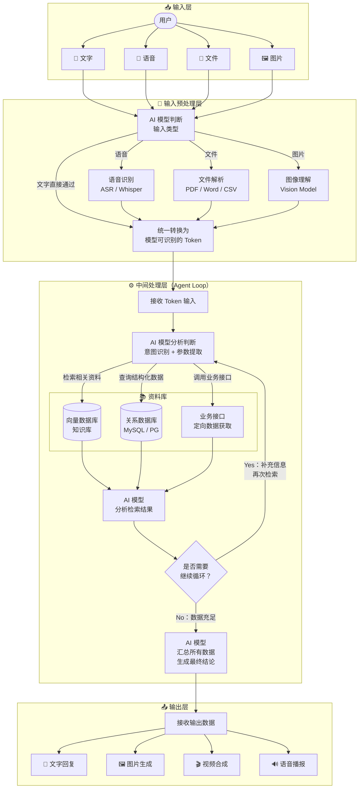

## AI 智能体系统全链路架构图

> **注**：中间层的「向量数据库」即飞书智能体中「知识库」的底层实现——将文档切片并向量化存储，查询时做语义相似度检索。飞书将其与内部文档系统打通，实现定时自动更新。

---

## 核心流程说明

| 阶段 | 关键动作 | 典型工具 |
|---|---|---|
| **输入预处理** | 多模态转 Token | ASR、Vision Model、文档解析器 |
| **意图识别** | AI 判断需要哪些数据 | Function Calling / Tool Use |
| **数据检索** | 从多源获取上下文 | 向量数据库、业务 API、关系数据库 |
| **循环推理** | 判断信息是否充足，不足则继续 | ReAct / Agent Loop |
| **汇总输出** | 整合所有数据生成最终响应 | LLM Summary |
| **结果呈现** | 按需渲染不同格式 | TTS、图片生成、富文本渲染 |

---
